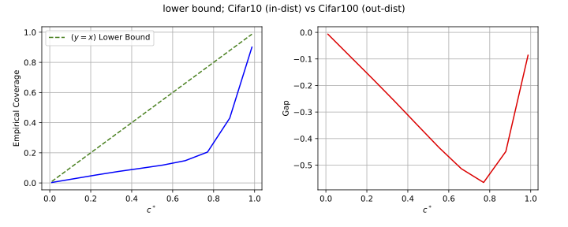
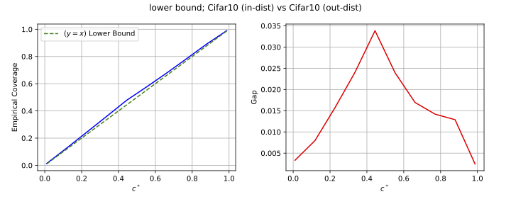

# Coverage Based Detection - a Simple Method for Detecting a Distribution Shift
This repository contains the official implementation of our paper: [DISTRIBUTION SHIFT DETECTION FOR DEEP NEURAL
NETWORKS](https://arxiv.org/pdf/2210.10897).

**TLDR**:
The method aims to detect deviations in the input distribution that could potentially harm the accuracy of the network's predictions.
The proposed method is based on selective prediction principles and involves continuously monitoring the network's operation over a test window and firing off an alarm when a deviation is detected.
The method outperforms the state-of-the-art approaches for this task on the CIFAR-10 and ImageNet datasets while being more efficient in time and space complexities.

## Demo
When using the CIFAR-10 dataset as in-distribution and the CIFAR-100 dataset as out-of-distribution, the lower bound is violated
(we use the Softmax Response (SR) of a ResNet18 as our confidence-rate function).

When using the CIFAR-10 dataset both for in distribution data and out-of-distribution data, the bound holds
(again, we use the Softmax Response (SR) of a ResNet18 as our confidence-rate function).

## Reproduce The Demo

clone and install this repository:

    git clone https://github.com/BarSGuy/Distibution-Shift-Detector.git
    cd Distibution-Shift-Detector
    pip install -r requirements.txt

download pretrained weights for resnet18 (resnet18.pt) from the following [link](https://drive.google.com/file/d/17fmN8eQdLpq2jIMQ_X0IXDPXfI9oVWgq/view),
and place it in the path './models/state_dicts/resnet18.pt'

run the following command

    main.py

## Detect a distribution shift on you own dataset

Copy the Detector file to your project, and set the desired parameters and the distribution shift detector
    
    from Detector import Shift_Detector as SD
    number_of_coverages = 10
    delta = 0.0001
    shift_detector = SD(C_num=number_of_coverages, delta=delta)

Inference your in-distribution data through your classifier, extract the $\kappa(x)$ for each input $x$, and fit the detector.
You can use our implementation of Softmax Response (SR) on you logits
    
    from Detector import get_softmax_responses as SR
    kappa_in_dist = SR(in_distribution_logits)
    detector.fit_lower_bound(kappa_in_dist)

and then check drifts on potentially out of distribution data
    
    kappa_out_dist = SR(out_of_distribution_logits)
    p_val = detector.detect_lower_bound_deviation(kappa_out_dist, return_p_value=True)
    if p_val < 0.01:
        raise RuntimeError("Drifted Inputs")
    
You can also visualize the drift per coverage (as in the demo)
    
    shift_detector.visualize_lower_bound()

## Citation

If you find our paper/code helpful, please cite our paper:

    @article{bar2022distribution,
        title={Distribution Shift Detection for Deep Neural Networks},
        author={Bar-Shalom, Guy and Geifman, Yonatan and El-Yaniv, Ran},
        journal={arXiv preprint arXiv:2210.10897},
        year={2022}
    }

